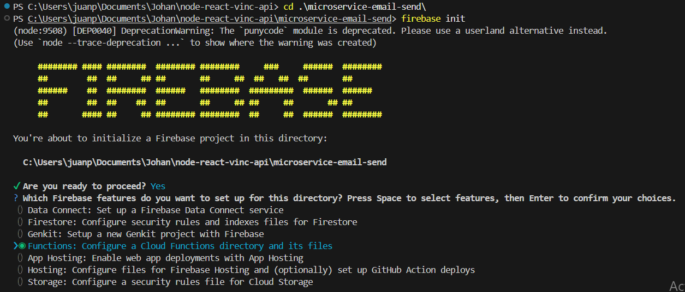
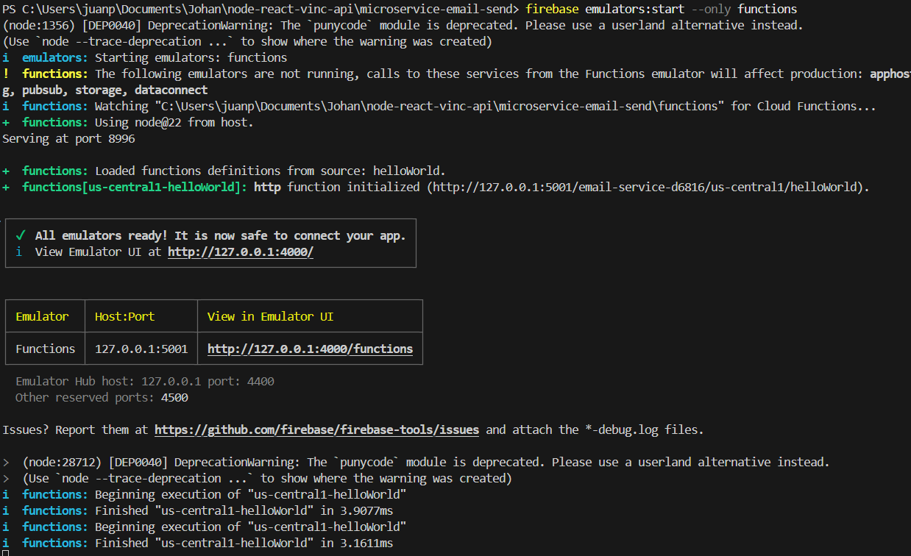

# Requisitos previos
- instalar el cli de firebase para poder trabajar de forma local

````
npm install -g firebase-tools
````
---
# Iniciar proyecto Firebase desde cero
1. Inicializa un proyuecto
    ````
    firebase init
    ````
2. Seleccionar la opcion de Functions 

1. Puedes seleccionar un proyecto existente de firebase o crear uno nuevo
2. Una vez realizado esto te muestra el lenguaje a utilizar javaScript, TypeScript o Python
3. puedes habilitar o desabilitar el ESLint
    - Detecta errores comunes: por ejemplo, variables sin usar, funciones mal definidas, etc.

    - Te ayuda a mantener un estilo consistente en tu código (nombres de variables, sangrías, uso de comillas, etc.).

    - Puede evitar errores difíciles de detectar antes de ejecutar el código.
    - Puede ser tambien engorroso con los tabulados o espacios en este proyecto esta desabilitado pero recuerda que no te analizaran variables sin uso y demas

---

# Comandos

## Ejecucion local del proyecto

- instalar dependencias

```bash
npm install
firebase emulators:start --only functions
```
Esto nos da una ruta para acceder a la funcion



## Deploy del proyecto en FIREBASE ponerlo en linea
```` bash
firebase deploy --only functions
````

# Notas importantes
- Todas las dependencias a usar en el prooyecto deben ser instaladas desde la carpeta functions 
  ````
  cd functions
  npm install nodemailer

  ````
- Aunque las dependdencias se instalen desde la carpeta functions la ejecucion del proyecto es desde la raiz es decir microservice-email-send
